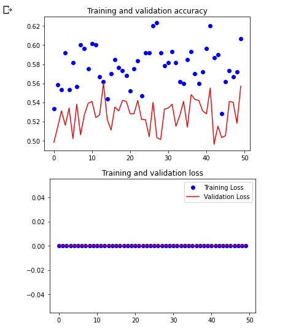
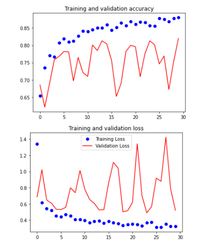

 # Project Interstice
## Introduction
**Surveillance** is an integral part of security and control. The job requires extended periods of looking into multiple video footages for an undesirable incident or evidence following the incident, which proves to be highly inefficient considering the massive amount of footages. This manual task provides evidence in court but is rarely used to ***prevent crime or react to it in real-time***. 
 

### 🔭 &nbsp; About this Project
In this project, we aim to develop a **real-time crime detection technology** that can be integrated with any security system, to ensure public safety through **visual crowd surveillance**. 
The system will detect and simultaneously alert any violent activity captured by the camera. The technologies encompasses domains of Computer Vision and Deep Learning models like **CNN, R-CNN, LSTM**. The dataset consists of 500+ videos scraped off internet and categorized into ***violent and non-violent*** activities. 
 

### 🛠 &nbsp;Tech Stack
&nbsp;
&nbsp;
&nbsp;
&nbsp;
&nbsp;
 

### 💼 &nbsp; Working
Though our major aim is to implement this system for ***Smart Monitoring***, we have also developed a micro-website based on **Django** to show the usefulness and effectiveness of this project. 
To use the website, please follow the following steps:
- Open the directory labelled website using command line
    > cd Visionary/Website
    
- Run the Django server by:
    > python3 manage.py runserver

 

*Note :* This Website required **OpenCV, Numpy, Django** and **Tensorflow** installed on the host machine. To install these dependencies, run the following command
> pip3 install -r requirements.txt

 

###  ✍️ &nbsp; Current Progress
We tried and tested various architectures for this project. A brief summary and stats for each is given below:
1. **Customised CNN Model**: The customised CNN model with optimised parameters performed well on the training and sufficiently good in the test dataset. The architecture is currently being used by the website and test.ipynb file.

    - Accuracy on training: 0.7990
    - Loss on training: 0.4292
    - Val_loss: 0.7605
    - Val_accuracy: 0.6680
    - Optimizer: Adam
    - Loss: BinaryCrossEntropy
    - Epochs: 50
    - steps_per_epoch: 50 
      
    
      

2. **VGG Net**: VGGNet Architecture displayed an accuracy of 60% on training and 55% on testing dataset.
    - Testing Accuracy: 0.5513
      
    
      

3. **AlexNet**: AlexNet showed accuracy of 57% on training and a similar accuracy on the testing dataset. 
    - Testing Accuracy: 0.5729
      
    
      

4. **Inception+CustomisedCNN**: Using transfer learning of Inception Architecture and passing it to CustomisedCNN trained the model with satisfactory results. 
*Link to model file* : [Google Drive Link](https://drive.google.com/file/d/1yTbm7oMn1znMEOD7X-s9NDqtyvpUZfTe/view?usp=sharing)
    - Training_accuracy: 89%
    - Validation_accuracy: 76%
    - Epochs: 30
    - Steps per Epoch: 100
    - Optimizer: RMSprop with LR 0.0001
    - Loss: Binarycrossentropy
      
    
      

### ⚙️ &nbsp; Ultimate Objective
The model uses the technique of Multiple Object Detection with Localization tracking the movement of people and then categorizing it into violent or non-violent behavior. Our proposed solution will ensure Public Safety and security without any human toil with an instant alert to the concerned authorities. Through ***Crowd Monitoring and Behavioral Analysis*** our solution aims to evoke the sense of security in men and women. The constant rise of criminal activities, their unexpectedness, and scope of harm that can be inflicted can be exponentially reduced through our proposed system. 

*Link to current protoytpe* : [Click Here](http://ec2-3-239-148-183.compute-1.amazonaws.com:8000/)
